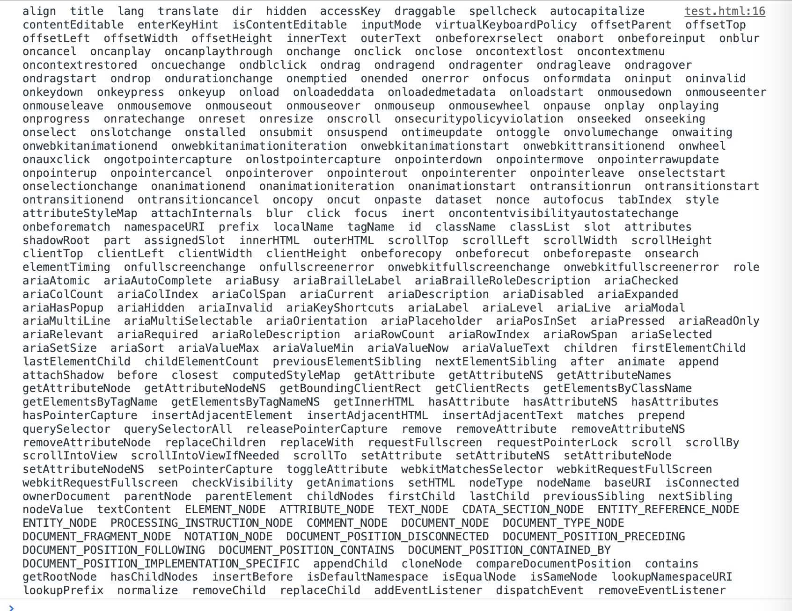

## 搭建开发环境

- rollup: 一般类库打包都使用 rollup,因为打包的 webpack5 体积小很多,主要用于打包 js 库。
- rollup-plugin-babel: 在 rollup 中使用 babel 插件
- @babel/core: babel 核心库
- @babel/preset-env: 将高级语法转成低级语法，需要按着预设（let const => var、箭头函数、类等的转换）

-c 指定配置文件、-w 监控文件变化

**问题**：为什么 vue2 只能支持>=ie9 以上，Object.defineProperty()不支持低版本的（Proxy 是 es6 的，也没有替代的方案。 没有对应的 es5 语法模拟）

1、Vue 是 MVVM 框架（基于 mvc 升级的，弱化了 controller 这一层） vue 每一完全遵循 mvvm，因为传统的 mvvm 框架是不能手动的操作数据的。（ref 可以操作组件数据）

2、new Vue({})表示 Vue 肯定是一个类，vue 源码没有采用 class 方式，是因为类的特点：将所有的方法全部耦合在一起（全放一个文件），当功能越多，方法就越多，不好管理。vue 在设计上，使用构造函数，让一些方法全部扩展在原型上，将不同的扩展功能放到不同文件中，更加好维护一点和管理

所有以$开头的变量，都认为是 vue 自己的变量

- 实现对象的响应式原理
- 实现数组的函数劫持

如果一个对象被劫持过了，那就不需要再被劫持了（要判断一个对象是否被劫持过，可以新增一个实例，用实例来判断是否被劫持过）

Object.defineProperty（重新定义属性，性能差） 只能劫持已经存在的属性，后增的，或者删除的 不知道（$set $delete）

$options $data

将 vm.\_data 用 vm 来代理 vm.name === vm.\_data.name

<!-- 整个核心：就是循环对象，每个属性用defineReactive重新定义，如果值还是对象的话，需要递归劫持。被劫持完后，为了用户能方便获取属性，把用户传的data选项放到了vm实例上的_data，但是取值还是有点麻烦，proxy代理方法，当取值时就去_data上取值 -->

修改数组很少用索引来操作数组，如果是数组时候就不要去循环了。
用户一般修改数组，都是通过方法来修改 push、pop...7 个方法，可以修改数组本身
对数组的每个值都进行观测（observeArray(data)）
保留数组原有的特性方法，并重新部分方法

**ob**不能被枚举，不然出现死循环

vue 默认劫持数组的时候，会把数组里的每个属性劫持添加 get set（当我们改变数组的第 0 个或第 1 个也能监控到。但是用户很少通过数组下标（索引）去改变数组。一般都是通过数组的一些 API 方法修改）。所以当是数组的时候，就不去循环了。
如果是数组，我们无非就去监控用户有没有调这些方法，这样的话，我们就可以重写这些方法

## 彻底掌握 Vue 的核心-响应式原理

Vue 响应式原理是面试中必考题，也是前端开发者提升自己技术深度的易学的框架。必须要掌握！！！

- 面试官：说一说 Vue 的响应式原理？
- 面试者：Vue 的响应式原理就是利用 Object.defineProperty()来劫持对象属性的 get 和 set，取值时进行`依赖收集`，设置值时进行`派发更新`。
- 面试官：能具体说说 Vue.js 源码是怎么实现响应式的吗？（Observer、Dep、Watcher 三者的关系？）
- 面试者：懵...

> Vue.js 为什么要有数据响应式？

我们都知道 Vue 的一个核心特点是 **数据驱动视图**，数据发生变化视图就要随之更新。

如果按照以往 Jquery 的思想咱们数据变化了想要同步到视图就必须要手动操作 DOM 更新。**但是**：`操作真实 DOM 又是非常耗费性能;1. 浏览器的标准就把 DOM 设计的非常复杂;2. DOM 的更新有可能带来页面的重绘或重排;`。那么有没有什么解决方案呢？当然是有的。`用 JS 的计算性能来换取操作 DOM 所消耗的性能。`--- Vue.js 核心：**虚拟 DOM**。

```js
let div = document.createElement('div')
let str = ''
for (const key in div) {
  str += key + '  '
}
console.log(str)
```



Vue 帮我们做到了数据变动自动更新视图而不用手动操作 DOM 的功能。 Vue 内部就有一个机制能`监听到数据变化然后触发更新`。

接下来让我们一起揭开 **响应式数据的原理** 的神秘面纱！

### 第一：手写响应式原理

#### Rollup 搭建开发环境

Rollup 是一个 JavaScript 模块打包器,可以将小块代码编译成大块复杂的代码， rollup.js 更专注于 Javascript 类库打包 （开发应用时使用 Webpack，开发库时使用 Rollup）

- rollup: 主要用于打包 js 库
- rollup-plugin-babel: 在 rollup 中使用 babel 插件
- @babel/core: babel 核心库
- @babel/preset-env: 将高级语法转成低级语法，需要按着预设（let const => var、箭头函数、类等的转换）

```sh
npm install rollup rollup-plugin-babel rollup-plugin-serve  @babel/preset-env @babel/code cross-env -D
```

新建 rollup.config.js

```js
import babel from 'rollup-plugin-babel'
// rollup 默认可以导出一个对象，作为打包的配置文件
export default {
  input: './src/index.js', // 入口
  output: {
    // 出口
    file: './dist/vue.js',
    name: 'Vue',
    format: 'umd', // esm es6模块 commonjs iife(自执行函数) umd(统一模块规范兼容AMD commonjs)
    sourcemap: true, // 可以调试源代码
  },
  plugins: [
    babel({
      exclude: 'node_modules/**', // 排除node_modules所有文件
    }),
  ],
}
```

新建.babelrc 文件

```json
{
  "presets": ["@babel/preset-env"]
}
```

配置执行脚本

```json
"scripts": {
    "dev": "rollup -cw"
}

```

#### 实现 Vue 响应式

1. 导出 Vue 构造函数

```js
import { initMixin } from './init'

function Vue(options) {
  this._init(options)
}

// 初始化
initMixin(Vue) // 扩展了init方法
// 把原型上方法扩展成一个个的函数，通过函数的方式，在其原型上扩展功能

export default Vue
```

2. init 方法中初始化 Vue 状态

```js
import { initState } from './state'

// 初始化
export function initMixin(Vue) {
  Vue.prototype._init = function (options) {
    // 在当前的实例上扩展一些属性$options $data...
    const vm = this
    vm.$options = options // 将用户的选项挂载实例上

    // 初始化状态/数据（Vue中的状态：props、data、computed、methods、watch）
    initState(vm)
    // todo...模板编译、创建虚拟dom。。。
  }
}
```

3. 根据不同属性进行初始化数据操作

```js
export function initState(vm) {
  const opts = vm.$options
  // vue的数据来源：属性、方法、数据、计算属性、watch
  if (opts.props) {
    initProps(vm)
  }
  if (opts.methods) {
    initMethods(vm)
  }
  if (opts.data) {
    initData(vm)
  }
  if (opts.computed) {
    initComputed(vm)
  }
  if (opts.watch) {
    initWatch(vm)
  }
}

function initProps() {}
function initMethods() {}
function initData(vm) {}
function initComputed() {}
function initWatch() {}
```

4. 初始化数据

```js
import { observe } from './observe.js'

function initData(vm) {
  // 初始化数据工作
  let data = vm.$options.data // 用户传递的data
  // data有可能是对象有可能是函数  用户可以通过_data获取数据
  data = vm._data = typeof data === 'function' ? data.call(this) : data
  // 对数据进行劫持
  // Object.defineProperty() 给属性添加get和set
  observe(data) // 响应式原理
}
```

5. 递归劫持每个属性

```js
import { isObject } from './util/index'
class Observer {
  constructor(value) {
    // vue 如果数据层数过多，需要递的去解析对象中的属性，依次增加set和get方法
    this.walk(value)
  }
  walk(data) {
    let keys = Object.keys(data)
    keys.forEach((key) => {
      defineReactive(data, key, data[key])
    })
  }
}

function defineReactive(data, key, value) {
  observe(value) // 多层对象，深度递归
  Object.defineProperty(data, key, {
    enumerable: true,
    configurable: true,
    get() {
      return value
    },
    set(newVal) {
      if (newVal === value) return
      observe(newVal) // 用户有可能设置的值是对象也需要监控
      value = newVal
    },
  })
}

export function observe(data) {
  if (!isObject(data)) return

  new Observer(data) // 用来观测数据的
}
```

6. 数组的劫持

```js
import { arrayMethods } from './array'
class Observer {
  constructor(value) {
    if (Array.isArray(value)) {
      // 如果是数据的话并不会对索引进行观测，因为会导致性能问题
      // 如果数组里放的是对象我再监控，不是对象就不监控了
      this.observerArray(value)
      // 注意：数组的劫持：1、劫持数组中的每一项，对数组中的7个方法进行重写
    } else {
      this.walk(value)
    }
  }

  observerArray(value) {
    for (let i = 0; i < value.length; i++) {
      observe(value[i]) // 监控数组的每一项
    }
  }
}
```

7. 重写数组原型上的方法

```js
// 重写数组的方法：push pop shift unshift reverse sort splice 这些方法都可以改变数组的本身

const oldArrayMethods = Array.prototype
export const arrayMethods = Object.create(oldArrayMethods)

const methods = ['push', 'pop', 'shift', 'unshift', 'splice', 'sort', 'reverse']

methods.forEach((method) => {
  arrayMethods[method] = function (...args) {
    console.log(`用户调用的方法：${method}`)
    const result = oldArrayMethods[method].apply(this, args) // 调用原生的方法 AOP
    const ob = this.__ob__
    // 需要判断一下当前用户通过数组添加的值是否是对象
    let inserted // 当前用户插入的元素
    switch (key) {
      case 'push':
      case 'unshift':
        inserted = args
        break
      case 'splice': // 新增 修改 删除的功能（新增的内容在第三个）
        inserted = args.slice(2)
      default:
        break
    }
    if (inserted) ob.observerArray(inserted)
    return result
  }
})
```

8. 增加`__ob__`属性

```js
class Observer {
    constructor(value) {
        // value.__ob__ = this;不能通过这种方式，会内存溢出 // 我给每一个i监控的对象都新增一个__ob__属性
        Object.defineProperty(value, '__ob__', {
            enumerable: false,
            configurable: false,
            value: this
        })
        ...
    }
}
```

9. 数据代理

```js
function initData(vm) {
  // 初始化数据工作
  let data = vm.$options.data // 用户传递的data
  // data有可能是对象有可能是函数  用户可以通过_data获取数据
  data = vm._data = typeof data === 'function' ? data.call(this) : data
  for (let key in data) {
    proxy(vm, '_data', key) // 将_data上的属性全部代理给vm实例
  }
  // 对数据进行劫持
  // Object.defineProperty() 给属性添加get和set
  observe(data) // 响应式原理
}

// 数据代理
function proxy(vm, source, key) {
  Object.defineProperty(vm, key, {
    get() {
      return vm[source][key]
    },
    set(newValue) {
      vm[source][key] = newValue
    },
  })
}
```

### 第二：分析 Vue.js 的打包流程

### 第三：阅读 Vue.js 响应式源码

### 第四：Vue3 的响应式原理是怎样实现的呢？
